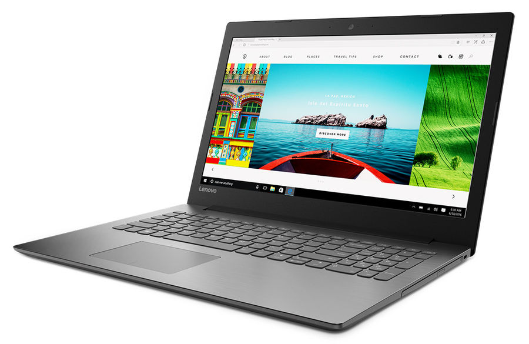

# Lenovo Ideapad 320-15ISK Hackintosh

## Характеристики
* **Процессор:** Intel Core i5-7200u (KabyLake)
* **Видеокарта:** Intel HD Graphics 620
* **Оперативная память:** 8Gb
* **Экран:** 15,5 дюймов Full HD
* **Трекпад:** Synaptics (I2C)
* **Wifi:** Dual Band Wireless-AC 3165 
* **Audio:** Realtek ALC230

## Что работает?
* Intel HD 620 
* Управление питанием процессора
* Батарея (циклы отображаются неправильно)
* Порт Realtek Ethernet
* Wi-Fi и Bluetooth (включая сервисы Apple)
* Внутренняя веб-камера с Facetime
* Трекпад Synaptisc с режимом GPIO (включая жесты)
* Сон (гибернация, сон крышки и пробуждение крышки)
* Яркость экрана горячими клавишами
* macOS Monterey 12
* Realtek ALC230 Audio (включая разъем для наушников)

## Что не работает?
* Микрофон не работает в Google Chrome, Firefox, Discord
* Нет звука, после сна, если был снят с зарядки

## Настройки BIOS
SATA Controller Mode to AHCI, HotKey Mode to Enabled. Security: Intel Platform Trust Technology to Enabled, Intel SGX to Software Controlled, Secure Boot to Disabled. Boot: Boot Mode to UEFI,Fast Boot to Enabled, USB Boot to Enabled. Exit: OS Optimized Defaults to Disabled.

